# jetpackSample

### MVVM patterns follow
### updated Implement Jetpack BOM(2023-5)
### UseFull Util
### Responsive UI
### Tap Target View
### Navigation With Animation
### Material 3
### Dagger Hilt implementation With Co-routines
### Implement Preference DataStore
### Higher Production Level setup(Environment)-> Develop,Staging,Production(release)
### Various Animations Implemented
### Augmenred Reality (Model view and Cursor point) Upgrade sceneView 9.9
### More Features Coming Up...

| | |
| --- | --- |
| 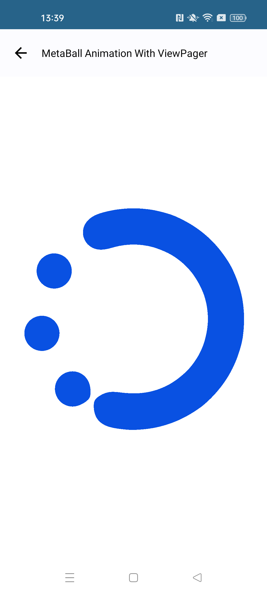 | 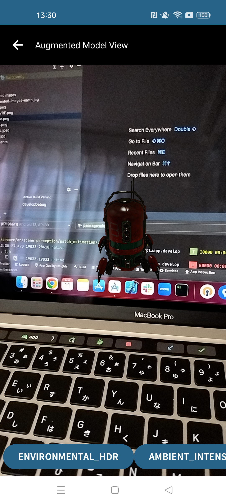 |
 | 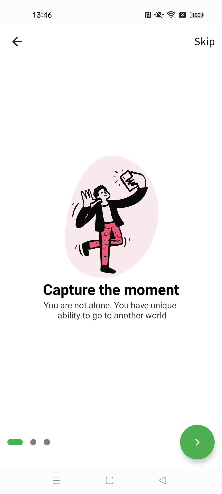 |
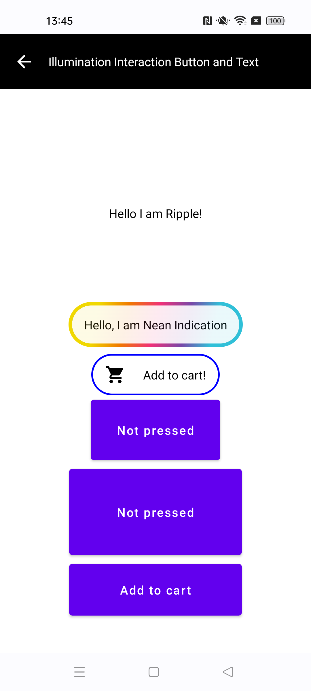 | 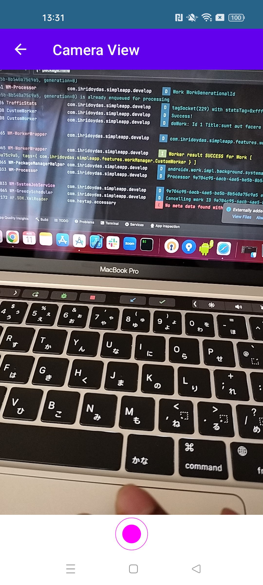 |
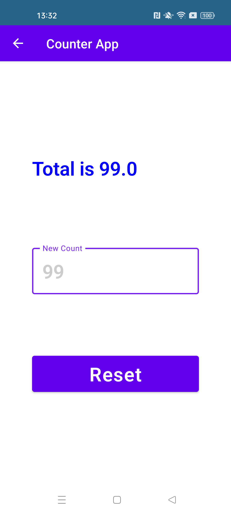 | 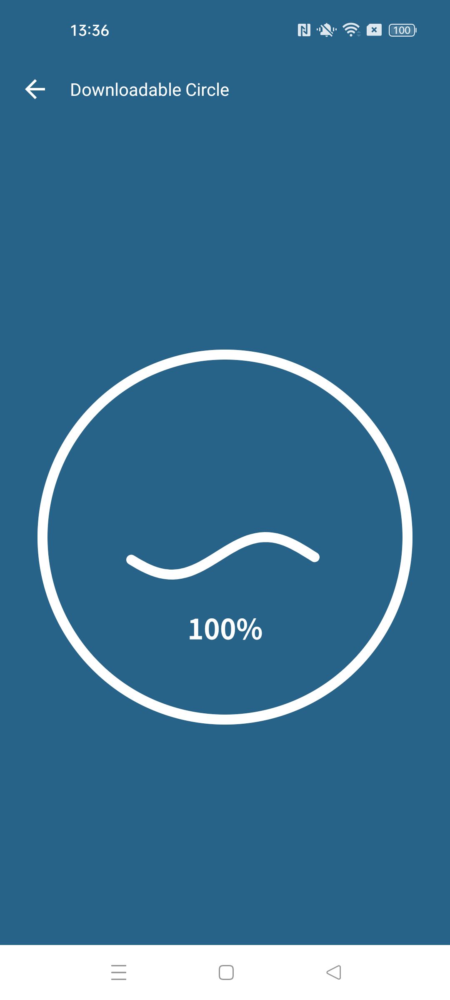 |
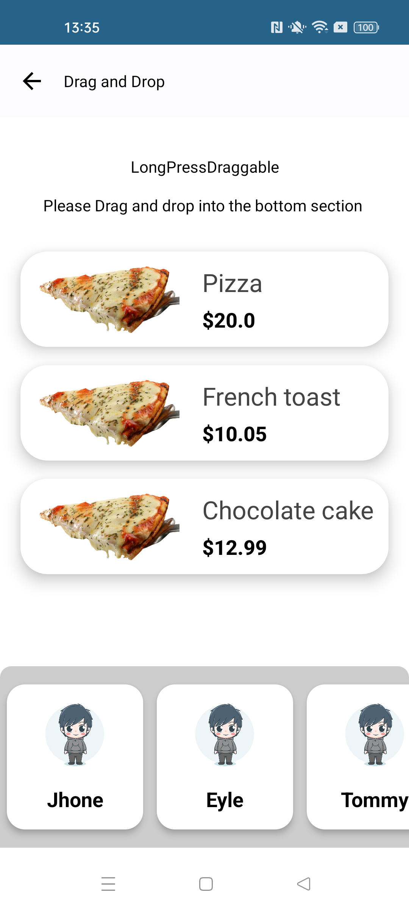 | 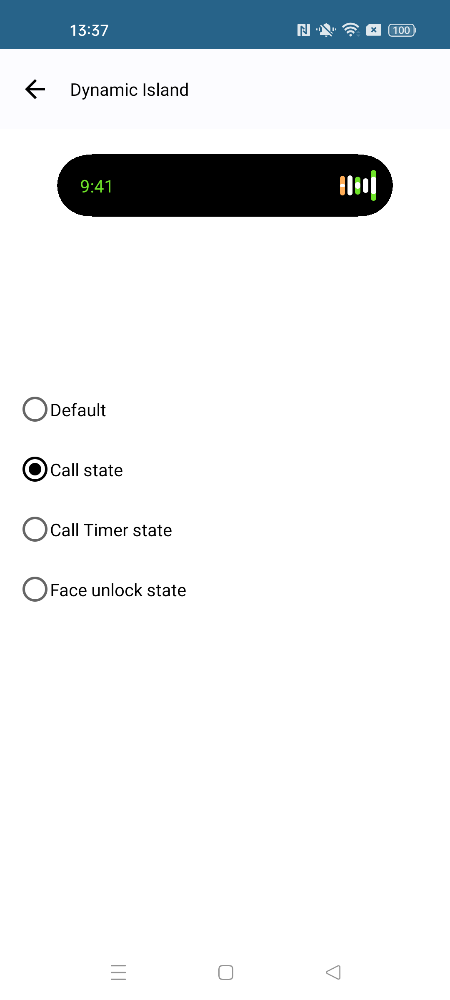 |
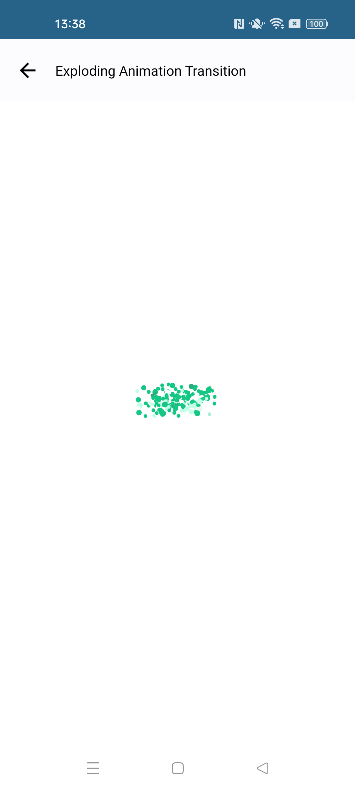 | 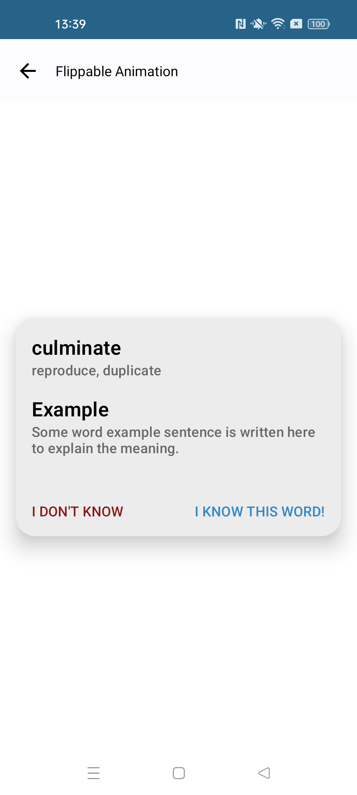 |
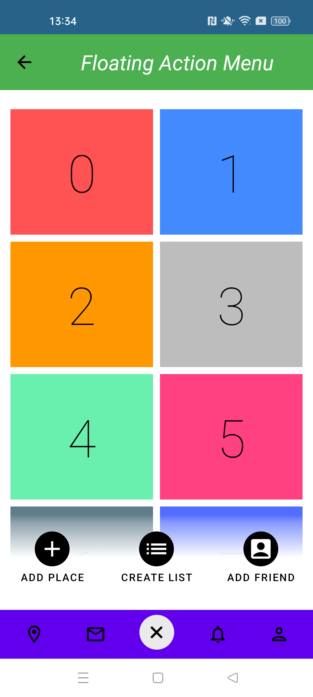 | 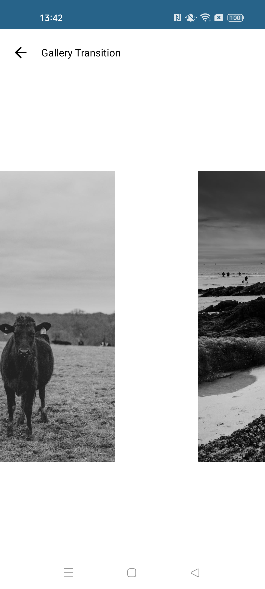 |
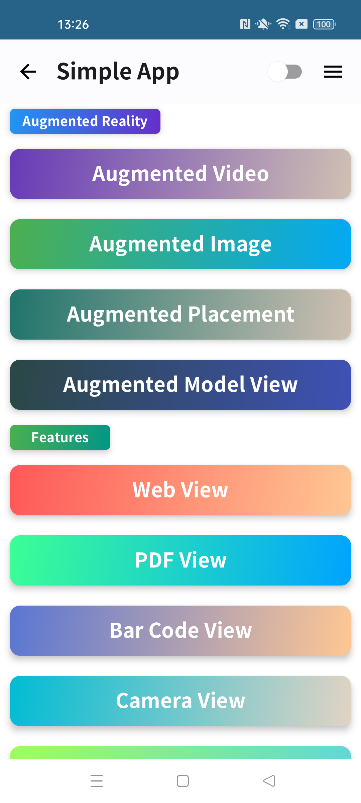 |  |
