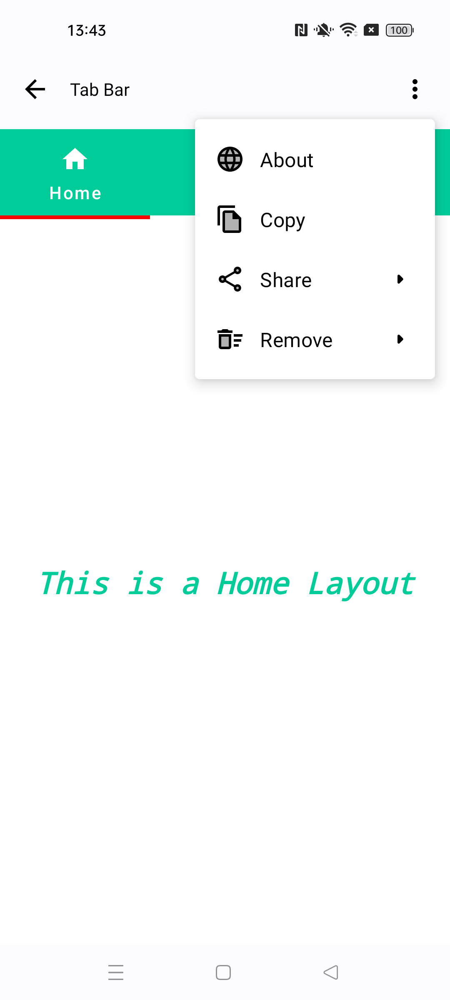
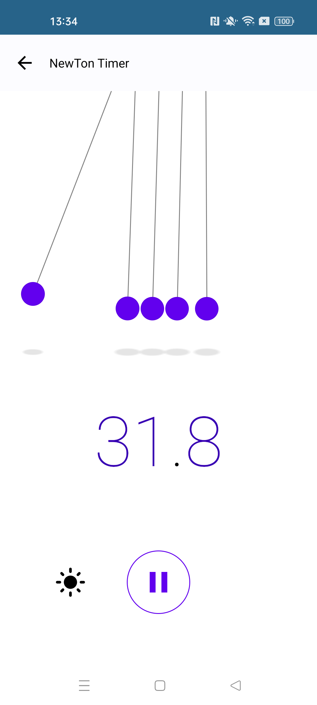

# jetpackSample (Practice Only)

🧬 Samples
------------

|                                                                       |                                                                                    |
|-----------------------------------------------------------------------|------------------------------------------------------------------------------------|
|         |               |
|        |              |
|      |                    |
|           |               |
|  |                |
|         |                |
|          |            |
|     |             |
|        |  |
|        |           |
|          |         |
|        |      |
|    |        |
|            |              |
|      |          |
|     |            |
|  |         |
|    |               |


🧬 Use Dependencies
------------

### MVVM patterns follow
### updated Implement Jetpack BOM(2023-5)
### UseFull Util
### Responsive UI
### Tap Target View
### Navigation With Animation
### Material 3
### Dagger Hilt implementation With Co-routines
### Implement Preference DataStore
### Higher Production Level setup(Environment)-> Develop,Staging,Production(release)
### Various Animations Implemented
### Augmenred Reality (Model view and Cursor point) Upgrade sceneView 9.9
### More Features Coming Up...


## License
```
Copyright 2022 The Android Open Source Project

Licensed under the Apache License, Version 2.0 (the "License");
you may not use this file except in compliance with the License.
You may obtain a copy of the License at

    https://www.apache.org/licenses/LICENSE-2.0

Unless required by applicable law or agreed to in writing, software
distributed under the License is distributed on an "AS IS" BASIS,
WITHOUT WARRANTIES OR CONDITIONS OF ANY KIND, either express or implied.
See the License for the specific language governing permissions and
limitations under the License.
```